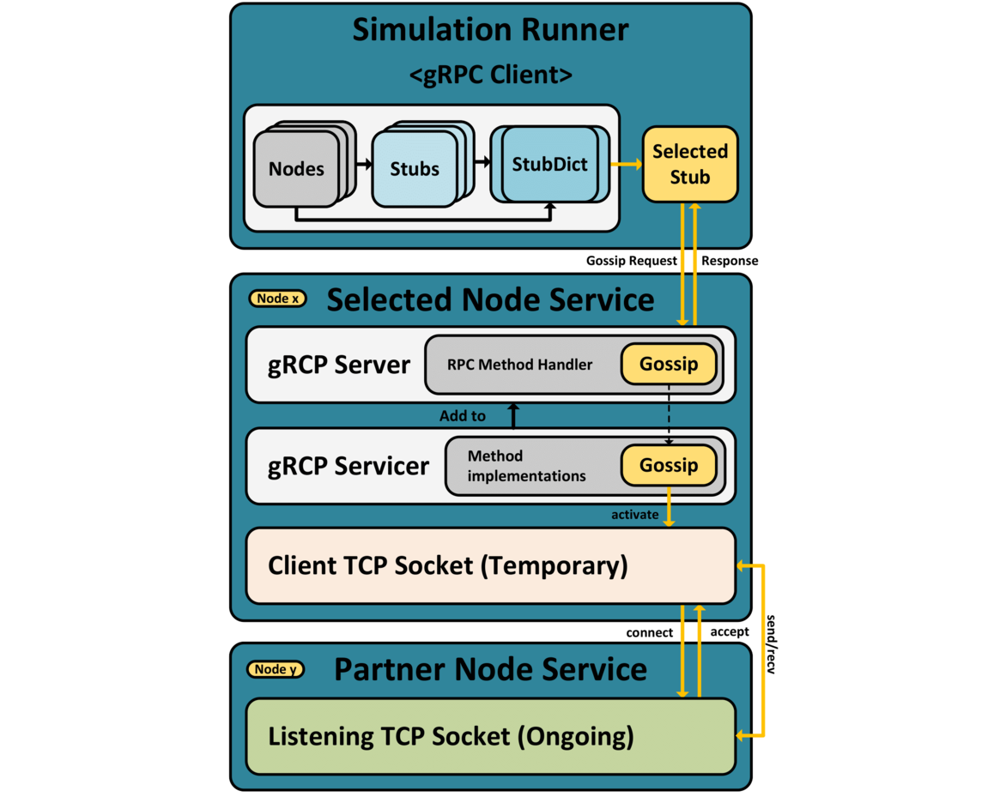

# Gossip Service
## Overview
The Gossip Node Service is a Python script designed to run in a Docker container inside a Kubernetes (K8s) cluster.
It is part of a distributed system where nodes communicate with each other over TCP.
Each Node Service runs inside a Docker container initiated by the "Simulation Operator" within a Kubernetes (K8s) cluster.
The Simulation Operator creates one service pod for each node in a network graph. 
The node is responsible for initializing and managing various gossip algorithms.
The service contains a gRPC server.
Its methods are invoked by the "Simulation Runner".
The Runner is responsible for managing the simulation.
This README provides an overview of the script, its purpose, and instructions for usage.

### Key Features:
- Dynamic algorithm selection based on configuration.
- Customizable algorithm parameters.
- Graceful shutdown using a stop event.

### Workflow: 

The Node Service implements different gossiping algorithms for communication among network nodes. 
 a summarized workflow and behavior of the Node Service, including the various algorithms:

- **Node Initialization:**

    Node Pods are created within Kubernetes, representing individual network nodes.
    Each Node Pod initializes itself with necessary data through environment variables, including the selected gossiping algorithm and information about neighboring nodes required for gossip exchange.


- **Algorithm Initialization:**

    The Node Service is initialized with a specific gossiping algorithm, which may include extensions like memory-based behavior.
    The available algorithms include:
    
  - *Baseline Algorithm*:
  This algorithm selects gossip partners entirely randomly, serving as a reference point for other algorithms.
  - *WeightedFactor Algorithm*: 
  It introduces partner weighting, favoring partners within the same community. The weight is a fixed value multiplied by a randomly selected probability.
  - *CommunityProbabilities Algorithm*: 
  It calculates probabilities for each neighboring node's membership in the same community, allowing targeted weighting in partner selection.
  - *Advanced Algorithms*:
  These include weighting by betweenness centralities, eigenvector centralities and hub scores. Each advanced algorithm has two variations.
  One of them includes a dynamic combination with the WeightedFactor algorithm, which also allows pure weighting only according to advanced metrics.
  Furthermore, a combination with the weights of the CommunityProbabilities Algorithm is implemented.
  - *Community-Based Gossiping*:
  The algorithm taken from the related work ["Community-based gossip algorithm for distributed averaging"](https://github.com/ChristelSirocchi/gossip_modularity)
  is also implemented.
  - *Memory-Based Extensions*: 
  These extensions introduce memory, where nodes remember previous communication partners and may have reduced probability of reselecting them. The "ComplexMemory" extension further modifies weights upon receiving new values.
  These algorithms can be initialized by the Simulation Operator based on user-defined settings.

 


- **Simulation Runner Coordination**:

    The Node Service operates under the coordination of the Simulation Runner Pod.
    The Runner keeps information on all the nodes in a dictionary of stubs.
    The simulation is coordinated by executing Remote Procedure Calls.


- **Gossiping Process**:

     When instructed by the Simulation Runner, a Node Service selects a neighboring node based on the chosen algorithm.
     It initiates a communication session with the selected neighbor using TCP to simulate realistic network communication.
     During communication, nodes may exchange information, and the algorithm-specific logic is applied to determine if they should update their own values.
     The gossiping process continues until a convergence criterion is met, typically when nodes agree on a common minimum value.


- **Result Storage**:

     The Node Service communicates the results of gossiping, which may include updated values or convergence status, to the Simulation Runner.
     These results are then collected and stored in Object Storage.


- **Termination**:

     The Node Service can be terminated by the Simulation Runner upon completion of the simulation.
     In summary, the Node Service's primary function is to execute the selected gossiping algorithm, enabling nodes to exchange information with their neighbors. The available algorithms offer different strategies for partner selection and information exchange, allowing for diverse simulations of network behavior and dynamics.

  



## Prerequisites
Before using this script within a K8s cluster, ensure you have the following prerequisites:

- Kubernetes Cluster
- Minio server (for result storage)
- Gossip Runner (Running gRPC client for communication)
- Docker (for containerization)
- Required Python libraries (specified in the script)

The [../proto/gossip.proto](../proto/gossip.proto) file defines the gRPC service and message types for communication between nodes. 
Ensure that the generated code for gRPC communication is used.

The client code generation is done by executing the command:
```bash
python -m grpc_tools.protoc -Iproto --python_out=. --grpc_python_out=. proto/gossip.proto
```

## Usage
To run this script within a K8s cluster, follow these steps:

1. Deploy the "Simulation Operator" within your Kubernetes cluster.
This operator is responsible for initiating and managing the simulation containers.

2. Create a K8s Custom Resource (CR) or YAML manifest to specify the simulation parameters. 
Ensure that you define the necessary environment variables, such as MINIO_ENDPOINT, MINIO_USER, MINIO_PASSWORD, and other simulation-specific variables.

3. Apply the CR or YAML manifest to start the simulation. The "Simulation Operator" will create a Docker container using this script, passing the environment variables and configurations.

4. The script will initiate the gossip simulation within the Docker container.
The results will be stored in the configured Minio bucket within the K8s cluster.

## Algorithm Parameters
You can customize various algorithm parameters by defining them within the K8s Custom Resource or YAML manifest. These parameters include the algorithm used, the number of repetitions, visualization settings, and more. Refer to the script comments for details on available parameters.
