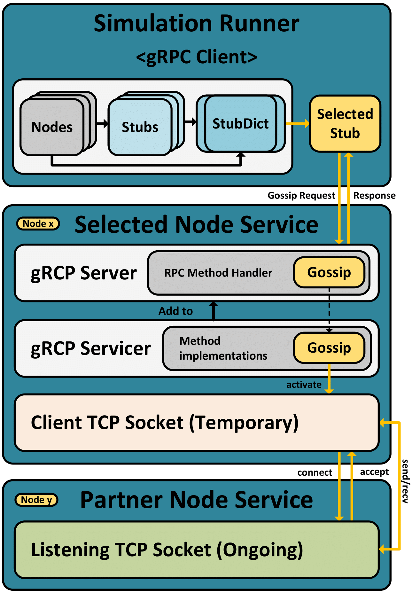

# Gossip Runner
## Overview
This Python script is designed to run a gossip simulation on a network graph within a Kubernetes (K8s) cluster. 
It is intended to be initiated by the Simulation Operator within the cluster. 
The script utilizes Minio for storing simulation results and communicates with nodes in the network using gRPC. 
It is highly configurable and can be used for various gossip-based simulations.

### Main Tasks of the Simulation Runner:

- **Initialization:**

    The Runner reads and processes environment variables containing essential simulation data such as 
    IDs, graph structure, algorithm parameters, and MinIO connection details.
    It Initializes data classes and constructs a NetworkX graph to represent the network state.

- **Node Value History:**

    Then, it utilizes gRPC calls to all Node services in parallel and asynchronously to retrieve initial node values.
    Afterwards, these initial node values are set as labels on the NetworkX graph.

- **(Optional) Visualization :**

    The Runner can generate a Gephi file for potential future visualization of the graph.
    Optionally, static and animated image files can be created using PyGraphViz for immediate visualization.

- **Gossiping Simulation:**

    The main task is the execution of the gossiping simulation.
    This is done by making synchronous gRPC calls to nodes to ensure a deterministic order.
    The calls order the nodes to perform Gossiping.
    After the gossiping round terminates, the values of the nodes are queried by making gRPC calls.
    This process can occur in parallel and asynchronously.

- **Result Persistence:**

    The Runner Persists simulation results in the MinIO Object Storage.
    It initializes a MinIO client, establishes a connection, and creates the required bucket if it doesn't exist.
    Results, including graph metrics, algorithm parameters, and round information are stored in JSON format. 
    The visualizations and node value history are also stored as objects.

- **Cleanup and Termination:**

    Algorithm parameters are set at the beginning of a run and cleaned up at the end.
    As a result, multiple different parameter configurations or combinations can be executed in seperated runs in a single simulation or series.
    Node services are asynchronously ordered to terminate when the last simulation concludes.
    Then, the next graph in the series can be initiated or the simulation can be stopped.
    When the last simulation on the last graph has finished, the application stops.

## Prerequisites
Before using this script within a K8s cluster, ensure you have the following prerequisites:

- Kubernetes Cluster
- Minio server (for result storage)
- Gossip Service (Running gRPC server for communication with network nodes)
- Docker (for containerization)
- Required Python libraries (specified in the script)

## Usage
To run this script within a K8s cluster, follow these steps:

1. Deploy the "Simulation Operator" within your Kubernetes cluster.
This operator is responsible for initiating and managing the simulation containers.

2. Create a K8s Custom Resource (CR) or YAML manifest to specify the simulation parameters. 
Ensure that you define the necessary environment variables, such as MINIO_ENDPOINT, MINIO_USER, MINIO_PASSWORD, and other simulation-specific variables.

3. Apply the CR or YAML manifest to start the simulation. The "Simulation Operator" will create a Docker container using this script, passing the environment variables and configurations.

4. The script will initiate the gossip simulation within the Docker container. The results will be stored in the configured Minio bucket within the K8s cluster.

## Simulation Parameters
You can customize various simulation parameters by defining them within the K8s Custom Resource or YAML manifest. These parameters include the algorithm used, the number of repetitions, visualization settings, and more. Refer to the script comments for details on available parameters.

## Result Storage
The simulation results, including PNG images, GIFs, GEXF files, and JSON data, will be stored in the specified Minio bucket within the K8s cluster. You can access and analyze the results as needed.