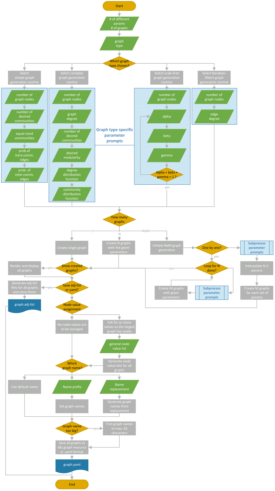

# Graph Generation CLI

This Python script is a command-line tool for generating and exporting various types of graphs. 
It provides flexibility in choosing the number of graphs, the type of graph to generate, and exporting options.

## Workflow
This command-line tool leverages the NetworkX Python library to facilitate the generation of various types of graphs. 
It supports multiple graph generation algorithms and can be used to generate multiple graphs at once.

### Features
- **Multiple Graph Generation Algorithms**: 

   This tool provides access to several graph generation algorithms, allowing users to create graphs with different characteristics.

- **Workflow Optimization**: 
   
   The tool optimizes the graph generation workflow through detailed flow diagrams. 
   It streamlines the process, especially when generating multiple graphs with varying parameters.

- **Graph Representation**: 

   Generated graphs can be stored both as adjacency lists and graph objects, following the Custom Resource Definition (CRD) format. 
   This simplifies graph management and ensures that all necessary parameters are retained.

- **User-Friendly CLI**: 

   The command-line interface is designed to minimize user inputs.
   The aim is to provide clear options for graph generation.

### Graph Generation Algorithms
- **Simple Graph Generation Routine**
   - *Parameters:*
     - Total number of nodes
     - Number of communities
     - Equal Community size
     - Intra-community edge probability
     - Inter-community edge probability
   - *Description*: This routine creates graphs with user-defined community structures. 
     Nodes are logically grouped into communities, and edges are added within and between communities based on specified probabilities.


- **Fixed Popularity Graph Generation**
  - *Parameters:*
    - Total number of nodes 
    - Number of communities 
    - Number of intra-community edges 
    - Number of inter-community edge probability 
  - *Description:* This routine generates fixed popularity graphs. 
  All nodes are distributed over communities of the same size.
  Then, edges are added within and between communities based until the threshold is reached.


- **Complex Graph Generation Routine**
  - *Parameters:*
    - Total number of nodes
    - Graph degree
    - Number of communities
    - Desired modularity
    - Degree distribution functions
  - *Description:* This routine generates complex synthetic graphs with random structures. 
    Users can control modularity and other parameters to create diverse graphs for testing and analysis.


- **Scale-Free Graph Generation**
  - *Parameters:*
    - Total number of nodes
    - Probability α of adding a new node connected to an existing node with degree `k`.
    - Probability β of rewiring an edge in the graph
    - Probability γ of adding a new node unconnected to any other node
    - Edge Multiplier for increasing total amount of edges added
  - *Description:* This routine generates scale-free graphs characterized by a power-law degree distribution. 
  Users can adjust probabilities to influence clustering and graph structure.


- **Barabási-Albert Graph Generation**
  - *Parameters:*
     - Total number of nodes
     - Number of edges to attach from a new node to existing nodes
  - *Description:* This routine applies the Barabási-Albert model to generate scale-free graphs. 
    It follows preferential attachment principles, resulting in hubs and natural community structures.


- **Holme-Kim Graph Generation**
  - *Parameters:*
     - Total number of nodes
     - Number of edges to attach from a new node to existing nodes
     - Probability of adding a triangle after adding an edge 
  - *Description:* This routine applies the Holme-Kim model to generate scale-free graphs. 
    It builds upon the Barabási-Albert model but adds additional edges to increase clustering.
  


### Process
1. Tool Initialization: Start the CLI tool by specifying the number of graphs to generate and the graph type.
2. Parameter Selection: Define the parameters for graph generation based on the chosen algorithm. 
   Parameters may include community sizes, modularity, degree distributions, and more.
3. Graph Generation: Generate the graphs based on the specified parameters. Users can create multiple graphs with the same or varying parameters.
4. (Optional) Graph Visualization: Visualize the generated graphs directly or export them for visualization using other libraries.
5. Graph Storage: Choose to save the generated graphs as adjacency lists or as Kubernetes Graph Resources in YAML format. 
   Optionally, assign static node values for comparative analysis.



## Getting Started

To use this tool, you need to have Python installed on your system.

1. Install the required dependencies:
    ```bash
    pip install -r requirements.txt
    ```
2. Run the CLI
    ```bash
    python graph_generation_cli.py
   ```
Command-Line Options:

   `--count`: Specifies the number of graphs to generate. 
   You can enter a single number (N) or a combination of MxN, where M is the number of different parameters, 
   and N is the number of graphs generated for each set of parameters. 
   Alternatively, you can also specify C/NxM with C being a number of graphs to select from all the generated graphs. 
   The graphs taken are chosen to be as close to the specified value of a chosen target metric as possible. 
   
   `--graph-type`: Allows you to choose the type of graph to generate from a predefined list of options.

### Interactive Prompts:

The CLI provides prompts for user input to specify the count and graph type. 
It handles various input formats for count.
The CLI supports the generation of multiple graphs with different parameters. I
t iterates through the specified count and creates graphs accordingly.
Users have the option to provide parameters either one by one, interpolate them or let them be randomly distributed.
After generating the graphs, the CLI computes various graph properties and metrics for each graph, 
such as modularity, average degree, clustering, assortativity, and many others.
Users can choose to select a subset of generated graphs based on a specific metric value to approximate. 
The CLI then identifies the closest graphs to the desired metric value.
Users can choose to export the generated graphs as adjacency lists or as Kubernetes (k8s) graph resource YAML files. 
They can also specify options for naming and node value assignment.
Additionally, there's an option to export the graphs in Gephi format for visualization.

## Examples
Here are some examples of how to use the CLI:

Generate 10 random scale-free graphs:

```bash
python graph_generation_cli.py --count=10 --graph-type=scale-free
```

Generate 5 graphs with different parameters, each with 10 variations:

```bash
python graph_generation_cli.py --count=5x10 --graph-type=barabasi-albert
```

Generate a subset of graphs with values close to a target metric:
```bash
python graph_generation_cli.py --count=20/10x5 --graph-type=fixed-popularity
```

## Resources
The CustomResourceDefinition for the graphs can be found under [./k8s/graph-resource.yaml](./k8s/graph-resource.yaml).
The graph resources that were created for the executed simulations can be found under [./k8s/simulation-series](./k8s/simulation-series).
Other example files can be found under [./k8s/examples](./k8s/examples).

## Sources
The complex graph generation algorithm was taken from the following project ["Random Modular Network Generator"](https://github.com/bansallab/modular_graph_generator). 