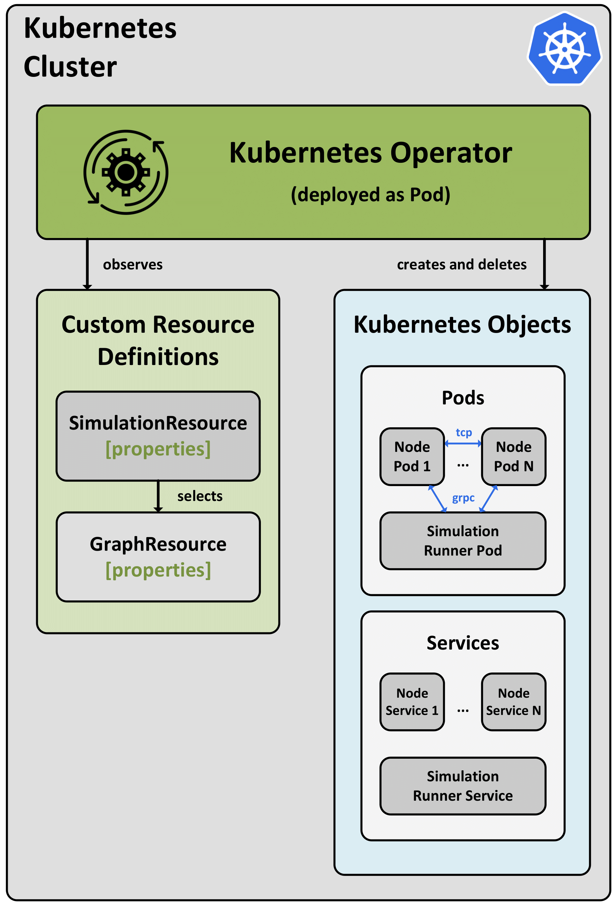
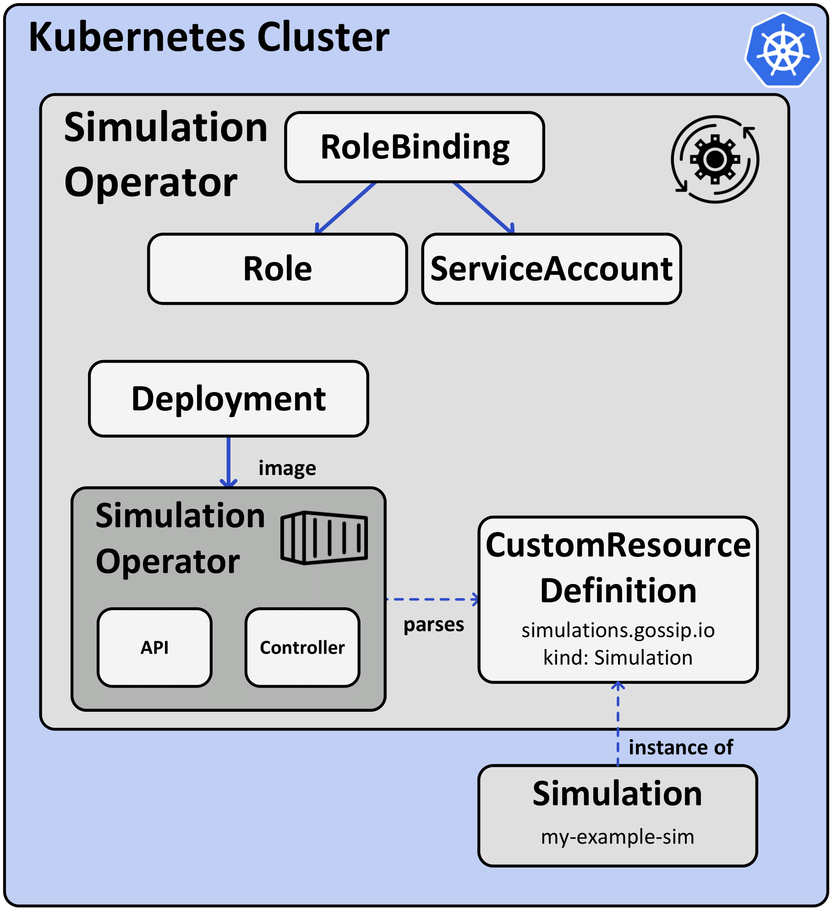

# Simulation Operator

## Overview
The Simulation Operator is a component designed to manage and orchestrate gossiping simulations within a Kubernetes (K8s) cluster. 
It deploys pods resembling a network graph.
Additional services and pods are used to manage the simulation, including the initialization and execution of various algorithms. 
This README provides an overview of what the Operator does, how it is deployed, and its key functionalities.

  


### Main functionality:
The Simulation Operator's primary purpose is to create and manage resources for simulations within a Kubernetes cluster. It utilizes the Kopf framework, which allows the definition of custom handlers for events related to custom resources (CRs). The Operator performs the following main functions:

- **Resource Creation:** 

  When a new Custom Resource Definition (CRD) object of type simulation is created, the Operator reads the specifications.
  It also selects associated graphs and their configuration, allowing it to initialize pods and services to resemble the network structure.
  The simulation runner is also created.


- **Resource Deletion:** 

    If a simulation object is deleted after a simulation, the Operator cleans up all the resources it created.
    The Operator can also gracefully abort a running simulation if the CRD object is deleted during execution.


- **Dynamic Algorithm Selection:** 

    The Operator supports dynamic graph and algorithm selection based on configuration, making it flexible for different simulation scenarios.
    It is possible to run simulations on a single graph or on a series of graphs.
    Also, users can specify the algorithm, algorithm parameters, and other settings.

## Prerequisites
Before deploying the Simulation Operator, ensure that the following prerequisites are met:

- A Kubernetes Cluster is available for deployment.
- A Minio server is set up for result storage. 
- Docker is installed for containerization.
- Required Python libraries ([requirements.txt](./requirements.txt)) are available.
- Docker image for Simulation Operator has been created.

Before running a simulation, also make sure that:
- The Custom Resource Definitions for the Graph and Simulation Objects have been created.
- The Docker images for the Runner and Node services have been created. 

### Deployment:
The Simulation Operator is deployed within the Kubernetes cluster using a static deployment. 
 The Operator is implemented using the Python Kopf framework, which acts as an interface to the Kubernetes Operator Framework. 
This framework simplifies interactions with the Kubernetes API and provides tools for managing Kubernetes objects like pods and services.

The Operator's deployment configuration includes the following elements:

- **Service Account:** A ServiceAccount named `simulation-operator-sa` is defined to control the permissions and access levels of the pods created by the Operator.

- **Secret:** A Secret named `operator-service-account-secret` is associated with the ServiceAccount and contains the necessary credentials for pod authentication.

- **Cluster Role Binding:** A ClusterRoleBinding named `simulation-operator-cluster-role-binding` binds the `cluster-admin` ClusterRole to the `simulation-operator-sa` ServiceAccount in the `default` namespace, granting it cluster-admin privileges within that namespace.



The following commands have to be run:


```bash
kubectl create -f .\k8s\simulation-operator-security.yaml

kubectl create -f .\k8s\simulation-operator.yaml
```

### Usage:
To use the Simulation Operator, follow these steps:

1. Deploy the Operator within your Kubernetes cluster using the provided Deployment configuration.

2. Create Custom Resource (CR) objects or YAML manifests that specify the simulation parameters, including the selected algorithm, algorithm parameters, and other settings.

3. Apply the CR objects or YAML manifests to start simulations. The Operator will create and manage the required pods and services based on the CR specifications.

4. The Operator will initiate and manage simulations, including resource cleanup when simulations are completed or aborted.

