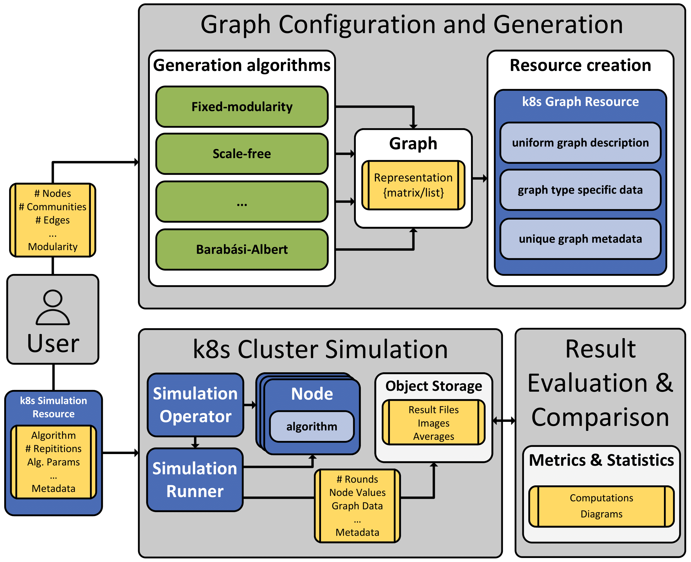

# Simulation Operator

The **Gossip Simulation** is based on a Kubernetes operator built with Python.
Its purpose is simulating different gossip protocols on variable network graphs.
The simulations run in a Kubernetes cluster. 
This README provides an overview of the project, how to build the Docker image, deploy it, and use it to manage simulations.

## Table of Contents
- [Architecture](#architecture)
- [Prerequisites](#prerequisites)
- [Minikube](#minikube)
- [Building the Docker Images](#building-the-docker-images)
- [Deploying the Object Storage](#deploying-the-object-storage)
- [Deploying the Operator](#deploying-the-operator)
- [Running a Simulation](#running-a-simulation)
- [Customization](#customization)

## Architecture
This project utilizes Kubernetes for conducting simulations, 
with a focus on efficient simulation management through a Kubernetes Operator. 
The system is designed to facilitate research by streamlining the configuration, execution, and analysis of simulations.

### Top Level Design
The system's architecture comprises three main components:

- **Graph Configuration and Generation**: 

   Users interact with a Command-Line Interface (CLI) to generate network graphs.
   They specify the generation algorithm as well as specific parameters.
   Graphs can then be obtained as adjacency lists or k8s resources in YAML representation.

- **Kubernetes Cluster Simulation**:

  The creation and deployment of simulation resources starts the simulation.
  The Simulation Operator manages the resource lifecycles, ensuring efficient use of Kubernetes resources.
  When a simulation is run, the operator creates pods for each network node.
  Then, a runner pod is deployed, which manages the simulation.


- **Result Evaluation and Comparison**

   Simulations can be run using different algorithms, configurations and networks.
   They can be evaluated by comparing metrics and statistics. 
   Various tools and routines can be used for analyzing simulation results, 
- including automated calculations and diagram generation.



Kubernetes is the chosen platform for running simulations, with local development conducted using minikube.
Test runs are performed in the dedicated cluster, enabling large-scale simulations.
Key static resources include the Kubernetes Operator and Object Storage.
The Node Services and the Simulation Runner Application are dynamically created and active during simulation execution. 
The Operator manages their lifecycles according to the simulation resource.


## Prerequisites

Before you begin, ensure you have the following prerequisites:
- Docker installed on your local machine
- Access to a Kubernetes cluster
- `kubectl` configured to communicate with your cluster

## Minikube

1. Install Minikube by following the installation instructions in the [official Minikube documentation](https://minikube.sigs.k8s.io/docs/start/).

2. Start a Minikube cluster by running the following command:

   ```bash
   minikube start --extra-config=kubelet.max-pods=1000
   ```
   
   This increases the max pod size, which is recommended to run this application.
   The pods are very lightweight.

3. Verify that Minikube is running and the cluster is healthy:

   ```bash
   minikube status
   ```
   You should see output indicating that the cluster is running.

4. You can now use Minikube to deploy and manage Kubernetes resources locally for development and testing purposes.
   With minikube only small simulations can be run.
   The accurate number is dependent on the hardware resources of the local machine.

## Building the Docker Images

To build the Docker images for the simulation environment, follow these steps:

1. Clone this repository:

   ```bash
   git clone <repository-url>
   ```
   
2. Build the images
   
   ```bash
   docker build -t user/node-app:latest .\Dockerfile.node
   
   docker build -t user/runner-app:latest .\Dockerfile.runner
   
   docker build -t user/simulation-operator:latest .\Dockerfile.operator
   ```
   
3. Push the images

   ```bash
   docker push user/node-app:latest 
   
   docker push user/runner-app:latest
   
   docker push user/simulation-operator:latest
   ```
   
   In case a multi-architecture image is needed use to build and directly push:
   ```bash
   docker buildx build --builder=eager_aryabhata --platform linux/amd64,linux/arm64 -t user/node-app --push:latest -f ./Dockerfile.node .
   
   docker buildx build --builder=eager_aryabhata --platform linux/amd64,linux/arm64 -t user/runner-app:latest --push -f ./Dockerfile.runner .
   
   docker buildx build --builder=eager_aryabhata --platform linux/amd64,linux/arm64 -t user/simulation-operator:latest --push -f ./Dockerfile.operator .
   ```
   If building images for a private gossip registry that is secured, the certificates can be copied to the build container:
   ```bash
   docker cp .\my_ca.crt buildx_buildkit_eager_aryabhata0:/usr/local/share/ca-certificates/my_ca.crt
   ```
   
## Deploying the Object Storage

For deploying the object storage, please refer to the instructions provided in the [Object Storage README](./minio/readme.md).


## Deploying the CustomResourceDefinitions
The CustomResourceDefinitions for the graph and simulation objects have to be created.
This can be done with the following commands:

```bash
kubectl create -f .\graph_generation\k8s\graph-resource.yaml

kubectl create -f .\operator\k8s\simulation-resource.yaml
```

## Deploying the Operator

To deploy the operator, follow the steps outlined in the [Operator README](./operator/readme.md).

## Running a Simulation
Follow these steps to run a simulation:

1. Create network graphs either directly as k8s resources or as adjacency lists with the [CLI Tool](./graph-generation/readme.md)
2. (Optional) If adjacency lists were created, manually define k8s graph resources 
3. Apply the graph resources (by using `kubectl apply -f`)
4. Create a simulation resource (define the graph or graph series, algorithm and parameters)
5. Apply the simulation resource (by using `kubectl apply -f`)
6. The operator now runs the simulations (logs can be checked during runtime or afterwards)
7. When the simulation is completed, delete the simulation resource (by using `kubectl delete -f`)

## Customization
You can customize the operator by modifying the python scripts and any other relevant files. 
If new algorithms are to be added, this can be done by extending the node application.
Additionally, you can customize the operator's behavior by adjusting the Kubernetes custom resource definitions (CRD).
   
   